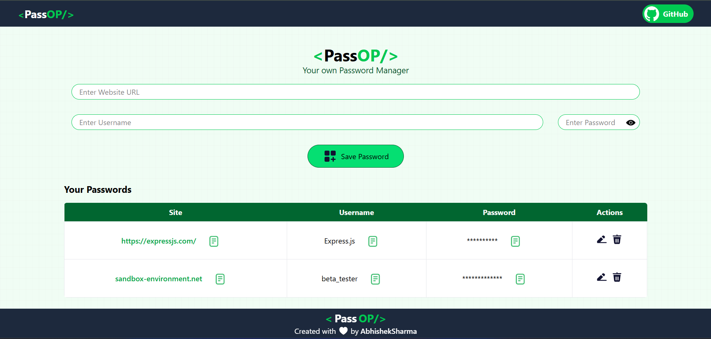
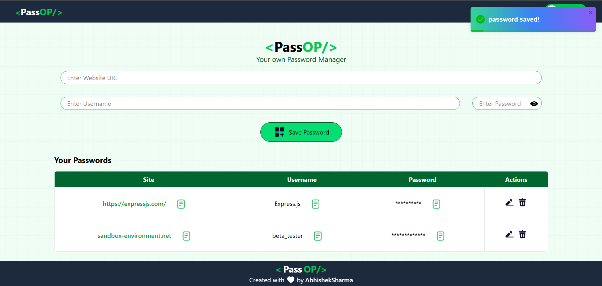

# 🔐 Password Manager

A full-stack Password Manager web application built using **React.js**, **TailwindCSS**, **Express.js**, **Node.js**, and **MongoDB**. This app allows users to securely store and manage their website credentials including **site URL**, **username**, and **password**.

---

## 🚀 Features

- ✅ Add new credentials (Site URL, Username, Password)
- 📝 Edit existing credentials
- ❌ Delete credentials
- 📦 Stored securely in a MongoDB database
- 🌐 Responsive UI built with TailwindCSS
- ⚙️ Full-stack integration with Express and MongoDB

---

## 🛠️ Tech Stack

**Frontend:**
- HTML
- TailwindCSS
- JavaScript
- React.js

**Backend:**
- Node.js
- Express.js
- MongoDB (using the official MongoDB Node.js driver)

---

## 📷 Screenshots

<!-- Upload your screenshots in the `screenshots/` folder and link them below -->

| Home Page | Add Password | Delete Password |
|----------|---------------|----------------|
|  |  |  |

---

## 📁 Setup Instructions

1. **Clone the repository**

```bash
git clone https://github.com/yourusername/password-manager.git
cd password-manager
```

2. **Install Frontend Dependencies**

```bash
npm install
```

3. **Install Backend Dependencies**

```bash
cd ../Backend
npm install
```

4. **Configure Environment**

***Create a .env file inside the Backend/ directory and add the following:***
```bash
MONGODB_URI=mongodb+srv://your_mongo_uri_here
PORT=3000
```

5. **Run the App**

***Run backend:***
```bash
cd Backend
npm run dev
```

***Run frontend:***
```bash
npm run dev
```

---

## 📬 Contact

Feel free to reach out with questions or feedback!

📧 **Email:** abhisheksharma270820@gmail.com
